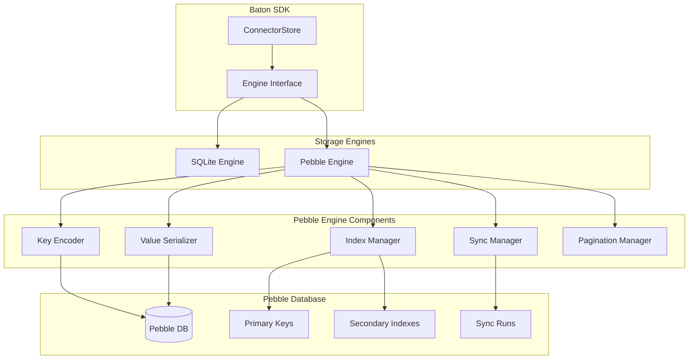

# Design Document

## Overview

This document describes the design for implementing a Pebble-based storage engine as an alternative to the current SQLite-based storage backend in the Baton SDK. The new engine will implement the `engine.StorageEngine` interface while providing improved performance, eliminating cgo dependencies, and maintaining full API compatibility.

The design leverages Pebble's LSM-tree architecture, efficient range operations, and Go-native implementation to provide a high-performance storage solution optimized for the Baton SDK's access patterns.

## Architecture

### High-Level Architecture



### Key Design Principles

1. **Interface Compatibility**: Complete implementation of `engine.StorageEngine`, `connectorstore.Reader`, and `connectorstore.Writer` interfaces
2. **Performance Optimization**: Leverage Pebble's LSM-tree for write-heavy workloads and efficient range scans
3. **Data Locality**: Structure keys to maximize scan efficiency and minimize I/O
4. **Atomic Operations**: Use Pebble batches for transactional consistency
5. **Scalability**: Support large datasets with efficient pagination and cleanup

## Components and Interfaces

### Core Components

#### 1. PebbleEngine

The main engine implementation that satisfies the `engine.StorageEngine` interface:

```go
type PebbleEngine struct {
    db            *pebble.DB
    currentSyncID string
    viewSyncID    string
    dbPath        string
    dbUpdated     bool
    workingDir    string
    
    // Key management
    keyEncoder    *KeyEncoder
    valueCodec    *ValueCodec
    
    // Index management
    indexManager  *IndexManager
    
    // Sync management
    syncManager   *SyncManager
    
    // Pagination
    paginator     *Paginator
    
    // Configuration
    options       *PebbleOptions
}
```

#### 2. KeyEncoder

Handles binary key encoding/decoding with proper sorting and prefix support:

```go
type KeyEncoder struct {
    version byte // v1 = 0x01
}

type KeyType byte
const (
    KeyTypeResourceType KeyType = 0x01  // rt
    KeyTypeResource     KeyType = 0x02  // rs
    KeyTypeEntitlement  KeyType = 0x03  // en
    KeyTypeGrant        KeyType = 0x04  // gr
    KeyTypeAsset        KeyType = 0x05  // as
    KeyTypeSyncRun      KeyType = 0x06  // sr
    KeyTypeIndex        KeyType = 0x07  // ix
    KeyTypeCounter      KeyType = 0x08  // ct
)
```

#### 3. ValueCodec

Handles protobuf serialization with minimal metadata envelope for conditional upserts:

```go
type ValueEnvelope struct {
    DiscoveredAt  int64  `protobuf:"varint,1,opt,name=discovered_at"`
    ContentType   string `protobuf:"bytes,2,opt,name=content_type,omitempty"` // Assets only
    Data          []byte `protobuf:"bytes,3,opt,name=data"`
}
```

The envelope is minimal and serves two specific purposes:
- **discovered_at**: Required for "IfNewer" conditional upsert semantics
- **content_type**: Required for assets only (omitted for other entity types)

#### 4. IndexManager

Manages secondary indexes for efficient querying:

```go
type IndexManager struct {
    engine *PebbleEngine
}

type IndexType byte
const (
    IndexEntitlementsByResource IndexType = 0x01  // en_by_res
    IndexGrantsByResource       IndexType = 0x02  // gr_by_res
    IndexGrantsByPrincipal      IndexType = 0x03  // gr_by_prn
    IndexGrantsByEntitlement    IndexType = 0x04  // gr_by_ent
    IndexSyncsByEndTime         IndexType = 0x05  // sr_by_end
    IndexUnfinishedSyncs        IndexType = 0x06  // sr_unfinished
)
```

#### 5. SyncManager

Handles sync lifecycle operations:

```go
type SyncManager struct {
    engine *PebbleEngine
}

type SyncRun struct {
    ID         string    `protobuf:"bytes,1,opt,name=id"`
    StartedAt  int64     `protobuf:"varint,2,opt,name=started_at"`
    EndedAt    int64     `protobuf:"varint,3,opt,name=ended_at"`
    Token      string    `protobuf:"bytes,4,opt,name=token"`
    Type       string    `protobuf:"bytes,5,opt,name=type"`
    ParentID   string    `protobuf:"bytes,6,opt,name=parent_id"`
}
```

## Data Models

### Key Structure

All keys follow a hierarchical structure for efficient range operations:

```
v1|{entity_type}|{sync_id}|{entity_specific_components}
```

#### Primary Keys

1. **Resource Types**: `v1|rt|{sync_id}|{external_id}`
2. **Resources**: `v1|rs|{sync_id}|{resource_type_id}|{resource_id}`
3. **Entitlements**: `v1|en|{sync_id}|{external_id}`
4. **Grants**: `v1|gr|{sync_id}|{external_id}`
5. **Assets**: `v1|as|{sync_id}|{external_id}`
6. **Sync Runs**: `v1|sr|{sync_id}`

#### Secondary Index Keys

1. **Entitlements by Resource**: `v1|ix|en_by_res|{sync_id}|{resource_type_id}|{resource_id}|{external_id}`
2. **Grants by Resource**: `v1|ix|gr_by_res|{sync_id}|{resource_type_id}|{resource_id}|{external_id}`
3. **Grants by Principal**: `v1|ix|gr_by_prn|{sync_id}|{principal_type}|{principal_id}|{external_id}`
4. **Grants by Entitlement**: `v1|ix|gr_by_ent|{sync_id}|{entitlement_id}|{principal_type}|{principal_id}|{external_id}`
5. **Syncs by End Time**: `v1|ix|sr_by_end|{sync_type}|{ended_at_desc}|{sync_id}`
6. **Unfinished Syncs**: `v1|ix|sr_unfinished|{started_at_desc}|{sync_id}`

### Key Encoding Details

#### Binary Encoding

- **Version**: Single byte (0x01 for v1)
- **Entity Type**: Single byte enum
- **Separators**: 0x00 byte between components
- **String Encoding**: UTF-8 with escape sequences for 0x00 bytes
- **Timestamp Encoding**: Big-endian int64, inverted for descending order
- **UUID Encoding**: 16-byte binary representation

#### Escape Sequences

For string components containing 0x00 bytes:
- 0x00 → 0x01 0x01
- 0x01 → 0x01 0x02

### Value Structure

Values use a minimal protobuf envelope that preserves the essential metadata required by the existing interface:

```protobuf
message ValueEnvelope {
  int64 discovered_at = 1;                    // Required for IfNewer semantics
  string content_type = 2 [optional];         // Required for assets only
  bytes data = 3;                             // Serialized entity protobuf
}
```

**Rationale for the envelope:**
- **discovered_at**: The existing SQLite implementation uses this timestamp for conditional upserts in `PutResourceTypesIfNewer`, `PutResourcesIfNewer`, etc. These methods only overwrite existing records when `discovered_at` is newer.
- **content_type**: Assets require separate content type metadata that's returned alongside the binary data in `GetAsset`.
- **data**: The actual protobuf-serialized entity (ResourceType, Resource, Entitlement, Grant, or raw asset bytes).

For non-asset entities, `content_type` is omitted to minimize storage overhead.

## Error Handling

### Error Categories

1. **Key Encoding Errors**: Invalid key format or encoding issues
2. **Value Serialization Errors**: Protobuf marshaling/unmarshaling failures
3. **Database Errors**: Pebble-specific errors (corruption, I/O, etc.)
4. **Consistency Errors**: Index inconsistencies or referential integrity violations
5. **Sync Lifecycle Errors**: Invalid sync state transitions

### Error Handling Strategy

```go
type PebbleError struct {
    Op      string    // Operation being performed
    Key     []byte    // Key involved (if applicable)
    Cause   error     // Underlying error
    Code    ErrorCode // Categorized error code
}

type ErrorCode int
const (
    ErrorCodeKeyEncoding ErrorCode = iota
    ErrorCodeValueSerialization
    ErrorCodeDatabase
    ErrorCodeConsistency
    ErrorCodeSyncLifecycle
)
```

### Recovery Mechanisms

1. **Automatic Retry**: Transient errors with exponential backoff
2. **Index Rebuild**: Detect and rebuild corrupted secondary indexes
3. **Consistency Checks**: Validate referential integrity during operations
4. **Graceful Degradation**: Fall back to primary key scans when indexes fail

## Testing Strategy

### Unit Testing

1. **Key Encoding Tests**: Roundtrip encoding/decoding, sort order verification
2. **Value Serialization Tests**: Protobuf marshaling with metadata envelope
3. **Index Management Tests**: Index creation, updates, and consistency
4. **Sync Lifecycle Tests**: State transitions and cleanup operations
5. **Pagination Tests**: Token generation and boundary conditions

### Integration Testing

1. **Interface Compliance Tests**: Verify complete `StorageEngine` interface implementation
2. **Cross-Engine Compatibility Tests**: Compare results between SQLite and Pebble engines
3. **Performance Benchmarks**: Compare throughput and latency against SQLite
4. **Stress Tests**: Large dataset operations and concurrent access patterns

### Property-Based Testing

1. **Key Ordering Properties**: Verify lexicographic ordering maintains entity relationships
2. **Pagination Consistency**: Ensure stable pagination across concurrent modifications
3. **Index Consistency**: Verify secondary indexes always match primary data
4. **Sync Isolation**: Ensure sync operations don't interfere with each other

### Compatibility Testing

Cross-engine compatibility will be verified through comprehensive test suites that validate identical behavior between SQLite and Pebble implementations using the same test data and scenarios.

## Performance Considerations

### Write Optimization

1. **Batch Operations**: Group related writes into Pebble batches
2. **Index Maintenance**: Batch secondary index updates
3. **Sync Policies**: Configurable sync frequency (NoSync, Sync, per-batch)
4. **Write Amplification**: Minimize redundant index entries

### Read Optimization

1. **Iterator Reuse**: Pool iterators for range scans
2. **Bloom Filters**: Enable for point lookups
3. **Block Cache**: Configure appropriate cache sizes
4. **Prefetching**: Use iterator prefetching for sequential scans

### Memory Management

1. **Value Pooling**: Reuse byte slices for value encoding/decoding
2. **Iterator Cleanup**: Ensure proper iterator closure
3. **Batch Size Limits**: Prevent excessive memory usage in large batches
4. **Cache Tuning**: Balance block cache vs. table cache sizes

### Compaction Strategy

1. **Range Deletions**: Use for efficient sync cleanup
2. **Manual Compaction**: Trigger after large deletions
3. **Level Configuration**: Optimize for write-heavy workloads
4. **Tombstone Management**: Monitor and manage tombstone accumulation

## Operational Concerns

### Monitoring and Observability

#### Metrics

```go
type PebbleMetrics struct {
    // Operation counters
    ReadOps    int64
    WriteOps   int64
    DeleteOps  int64
    ScanOps    int64
    
    // Performance metrics
    ReadLatency    time.Duration
    WriteLatency   time.Duration
    ScanLatency    time.Duration
    
    // Storage metrics
    DatabaseSize   int64
    CompactionOps  int64
    BloomHits      int64
    BloomMisses    int64
    
    // Error counters
    KeyEncodingErrors      int64
    ValueSerializationErrors int64
    DatabaseErrors         int64
}
```

#### Logging

1. **Slow Operation Logging**: Log operations exceeding threshold
2. **Error Context**: Include key and operation context in error logs
3. **Compaction Events**: Log major compaction operations
4. **Index Rebuilds**: Log index consistency repairs

### Maintenance Operations

#### Database Integrity

```go
type IntegrityChecker struct {
    engine *PebbleEngine
}

func (ic *IntegrityChecker) CheckIndexConsistency(ctx context.Context) error
func (ic *IntegrityChecker) RebuildIndexes(ctx context.Context) error
func (ic *IntegrityChecker) ValidateReferentialIntegrity(ctx context.Context) error
```

#### Compaction Management

```go
type CompactionManager struct {
    engine *PebbleEngine
}

func (cm *CompactionManager) TriggerManualCompaction(ctx context.Context) error
func (cm *CompactionManager) EstimateSpaceReclamation(ctx context.Context) (int64, error)
func (cm *CompactionManager) ConfigureCompactionPolicy(policy CompactionPolicy) error
```

### Configuration

#### Engine Options

```go
type PebbleOptions struct {
    // Database options
    CacheSize           int64
    WriteBufferSize     int64
    MaxOpenFiles        int
    
    // Performance tuning
    BloomFilterBits     int
    BlockSize           int
    CompactionConcurrency int
    
    // Operational settings
    SlowQueryThreshold  time.Duration
    BatchSizeLimit      int
    SyncPolicy          SyncPolicy
    
    // Monitoring
    MetricsEnabled      bool
    MetricsInterval     time.Duration
}

type SyncPolicy int
const (
    SyncPolicyNoSync SyncPolicy = iota
    SyncPolicyPerBatch
    SyncPolicyPerOperation
)
```

## Deployment

The Pebble storage engine will be implemented as a complete `StorageEngine` interface implementation that can be used as a drop-in replacement for the SQLite engine. Engine selection will be controlled through configuration, allowing users to choose their preferred storage backend.