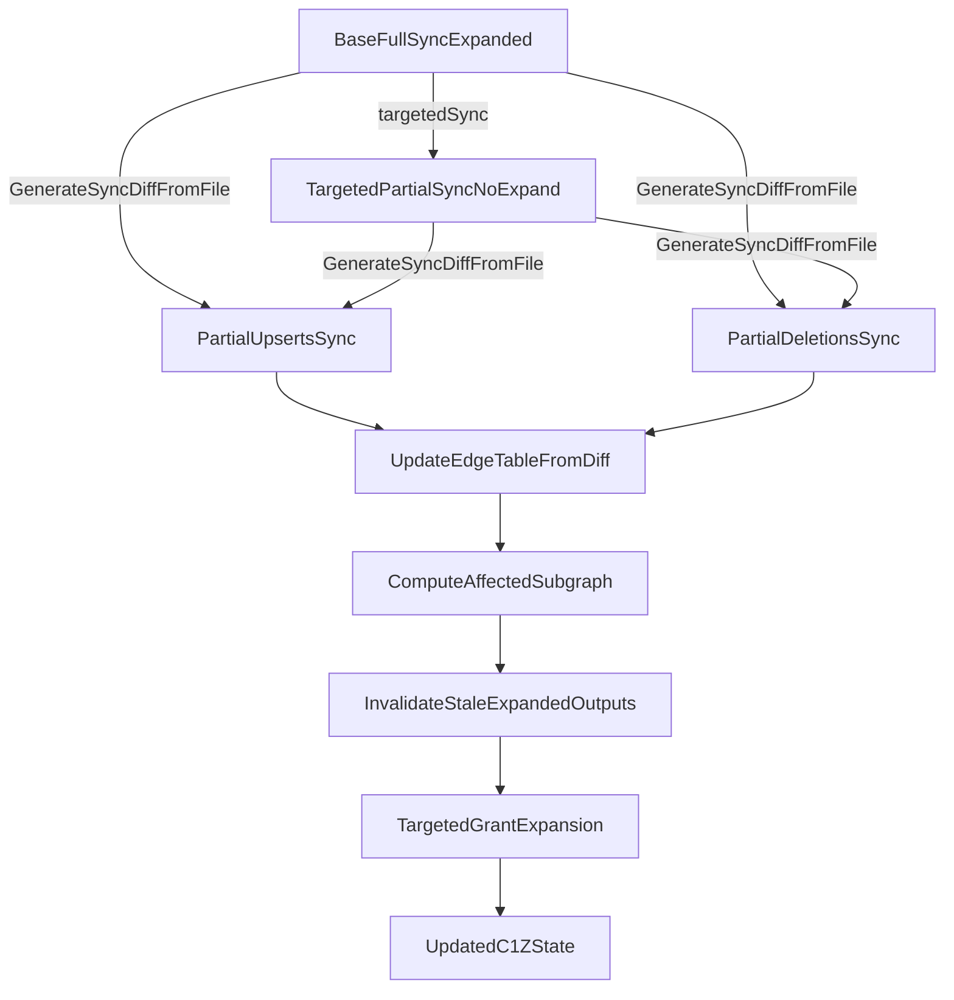

## Overview

This document describes an end-to-end design for incremental grant expansion in baton-sdk when applying sync diffs produced by `GenerateSyncDiffFromFile`. The goal is to:

- Persist an entitlement-edge graph (derived from `GrantExpandable`) in dotc1z sqlite.
- Update that graph from diff upserts/deletions.
- Run grant expansion only on the affected subgraph (and invalidate stale expansion outputs).
- Avoid spurious diffs caused by baton internal rewrites (e.g., stripping `GrantExpandable`).

## Background (current behavior)

### Diff generation

`GenerateSyncDiffFromFile` produces two partial syncs:

- Partial upserts: additions + modifications
- Partial deletions: deletions

Today, "modification" is detected by comparing the serialized `data` blob (`a.data != m.data`).

### Grant expansion

Grant expansion constructs an entitlement graph by scanning grants for the `GrantExpandable` annotation and adding edges of the form:

`(srcEntitlementID -> dstEntitlementID, shallow, resourceTypeIds)`

Today, expansion also strips `GrantExpandable` from the stored grant after ingesting it into the in-memory graph.

### Targeted-resource partial syncs

Targeted-resource partial syncs do not run grant expansion. They produce "connector-truth" grants/entitlements for a limited scope.

## Problem

In the pipeline:

1) Base sync has expansion run (and may strip annotations / rewrite grants).
2) Targeted partial sync runs (no expansion).
3) `GenerateSyncDiffFromFile(old=base, new=targeted)` yields upserts/deletions.
4) We want to update an entitlement graph and expand grants only where necessary.

Two issues arise:

- Internal rewrites (like stripping `GrantExpandable`) can create diffs when comparing `data` bytes.
- Deletion of relationship-defining grants must retract edges even if the base sync no longer contains the original annotation.

## Goals

1) The diff should represent connector-truth changes, not baton-internal rewrites.
2) Entitlement-edge graph should be durable and queryable (sqlite tables).
3) Graph updates should be diff-driven and incremental.
4) Expansion should run only on the affected subgraph.
5) Deletions must be handled (invalidate/retract derived outputs).

## Non-goals (initial iteration)

- Replacing the existing `expand.Expander` algorithm.
- Making targeted partial syncs themselves run expansion.
- Perfect minimal invalidation; correctness first, then optimize.

## Design

### 0) New annotation for edge definitions: `GrantExpansionEdges`

Introduce a new grant annotation type `GrantExpansionEdges` that carries the same fields as `GrantExpandable` (the edge definition payload), but with a new name/type intended specifically for representing expansion edges durably.

Rollout/compatibility:

- During a transition period, graph construction should accept **either** `GrantExpansionEdges` or legacy `GrantExpandable`.
- Prefer `GrantExpansionEdges` when present.

Why:

- It avoids overloading `GrantExpandable` as both an edge-definition signal and an internal “processed/consumed” marker.
- It enables baton to evolve internal processing (including hashing/diff behavior) without ambiguity about whether “annotation missing” means “edge removed” vs “annotation was stripped as a bookkeeping step.”

### A) Stable row hash to make diffs meaningful (hash-of-bytes, but "sometimes" not updated)

We add a stable hash column (e.g. `row_hash`) to rows in:

- resources
- entitlements
- grants
- (optionally) resource types

Definition:

- `row_hash = sha256(deterministic_proto_bytes)`

Update policy:

- Most writes update `row_hash`.
- Exception(s): specific baton internal rewrites (notably: the rewrite that strips `GrantExpandable`) must update `data` but preserve `row_hash`.

Diff predicate change:

- In `GenerateSyncDiffFromFile`, treat modifications as:
  - `a.row_hash != m.row_hash`
  instead of:
  - `a.data != m.data`

Why this helps:

- If baton rewrites stored bytes for internal bookkeeping, we can avoid diff churn by keeping `row_hash` tied to the "meaningful" version (connector-truth).

Implementation notes:

- Deterministic marshaling already exists; hashing is a pure function of the marshaled bytes.
- The internal rewrite path must be able to update the row without recomputing `row_hash` (e.g., specialized update method).

### B) Persisted entitlement-edge graph in sqlite

Add a new table to dotc1z sqlite, for example:

`v1_entitlement_edges`:

- `sync_id` (which sync run this edge graph is associated with; usually the "current"/latest state)
- `edge_key` (unique key; can be derived from src/dst/shallow/rtids)
- `src_entitlement_id`
- `dst_entitlement_id`
- `shallow` (bool)
- `resource_type_ids` (canonical encoding; see below)
- `source_grant_external_id` (provenance: which grant defined this edge)
- timestamps (optional): `created_at`, `updated_at`, `deleted_at`

Uniqueness:

- unique(sync_id, edge_key)
  or
- unique(sync_id, src_entitlement_id, dst_entitlement_id, shallow, resource_type_ids_hash)

Indices:

- (sync_id, src_entitlement_id) for descendant traversal
- (sync_id, dst_entitlement_id) for ancestor lookup
- (sync_id, source_grant_external_id) for deletion-by-grant provenance cleanup

Resource type IDs encoding:

- Canonical JSON array of strings (sorted) or deterministic bytes + hash.

### C) Updating the graph from diff upserts/deletions

Inputs:

- `upsertsSyncID` (partial_upserts)
- `deletionsSyncID` (partial_deletions)

Both are linked to `parent_sync_id` (the base) by `GenerateSyncDiffFromFile`.

Graph update algorithm:

1) Process deletions:
   - For each deleted grant (external_id) in deletionsSync:
     - delete all edges where `source_grant_external_id = deletedGrantID`
   - For each deleted entitlement:
     - delete all edges where src=entitlement_id OR dst=entitlement_id

2) Process upserts (authoritative new state for those rows):
   - For each upserted grant:
     - delete all edges where `source_grant_external_id = grantID` (reset provenance)
     - parse `GrantExpansionEdges` (fallback to legacy `GrantExpandable`)
     - if present, insert edges derived from that annotation with `source_grant_external_id = grantID`

This works even when:

- the old/base copy no longer has the annotation (because we retract edges by provenance, not by parsing the deleted row).

### D) Targeted expansion on the affected subgraph

We compute an affected entitlement set and only expand there.

#### Seed set

Seeds include entitlements referenced by changed edge definitions:

- From upserted relationship grants: all src entitlement IDs (from annotation) + the dst entitlement ID (the grant’s entitlement).
- From deleted relationship grants: collect impacted entitlements by reading the edges that were deleted-by-grant (either query-before-delete or delete-returning pattern).
- From deleted entitlements: the deleted entitlement itself plus its neighbors (via edge table).

#### Closure

Compute closure A by walking descendants from the seed set using `v1_entitlement_edges` adjacency (within the relevant sync_id):

- A includes seeds and all reachable dst entitlements.
- (Optional) include ancestors too if needed for correct ordering constraints.

#### Invalidate stale expansion outputs in A

Because expansion is additive, we need invalidation when edges or source grants are removed.

Basic invalidation approach:

- For each entitlement in A:
  - scan its grants
  - remove `GrantSources` references that correspond to source entitlements no longer connected via the current edge graph
  - if a grant becomes empty and is identifiable as expansion-only (e.g., `GrantImmutable`-created), delete it

This can be refined over time, but correctness is the priority.

#### Re-expand only within A

Build an in-memory `expand.EntitlementGraph` consisting of:

- nodes: entitlements in A
- edges: edges between entitlements in A (from `v1_entitlement_edges`)

Run `expand.Expander` over this graph to completion.

This limits expansion work to the changed/invalidated region instead of requiring a full scan of all grants.

## Data flow

## Testing strategy

1) Hashing behavior:
   - Verify that the internal \"strip annotation\" rewrite updates `data` but preserves `row_hash`.
   - Verify that `GenerateSyncDiffFromFile` using `row_hash` does NOT mark those rows as modified.

2) Edge persistence:
   - Upserted grant with `GrantExpandable` adds edges to `v1_entitlement_edges`.
   - Deleted relationship grant removes edges by `source_grant_external_id` even if the deleted row has no annotation.

3) Targeted expansion correctness:
   - Given a base expanded sync + targeted diff, ensure expansion produces correct derived grants but only touches the affected entitlement set.

## Risks / open questions

- Identification of expansion-only grants:
  - Today, expansion-created new grants add `GrantImmutable`; ensure this is consistently usable for safe deletion.
- Closure definition:
  - Descendant-only vs including ancestors (depends on ordering constraints in the expander graph logic).
- Performance:
  - Closure queries need indices; invalidation needs to avoid full scans.

## Rollout plan

1) Add `GrantExpansionEdges` (proto + generated code) and make graph/edge extraction read it (fallback to `GrantExpandable`).
2) Add `row_hash` and switch diff modification detection to `row_hash`.
3) Add `v1_entitlement_edges` + provenance by grant.
4) Implement graph update from upserts/deletions diffs.
5) Implement affected-subgraph computation + invalidation + targeted expansion.
6) Add end-to-end tests and roll out behind a feature flag, then enable by default.

## Implementation checklist

### Annotation rename / semantics
- [ ] Add new annotation type `GrantExpansionEdges` (same payload as `GrantExpandable`) to `annotation_grant.proto` and regenerate pb.
- [ ] Update edge extraction to read `GrantExpansionEdges` (fallback to `GrantExpandable` for backward compatibility).
- [ ] Decide strip behavior:
  - [ ] preferred: do **not** strip `GrantExpansionEdges` (edge definition should be durable)
  - [ ] during migration: optionally strip only legacy `GrantExpandable` if needed

### Hashing / meaningful diffs
- [ ] Add `row_hash` column to `v1_resources`, `v1_entitlements`, `v1_grants` (and decide on resource types).
- [ ] Compute `row_hash = sha256(deterministic_proto_bytes)` for normal `Put*` writes.
- [ ] Add a dedicated update path for the expansion “strip `GrantExpandable`” rewrite that **does not** update `row_hash`.
- [ ] Update `GenerateSyncDiffFromFile` modification detection to `a.row_hash != m.row_hash` (instead of `a.data != m.data`).
- [ ] Add tests proving expansion-strip rewrites do not create spurious upserts.

### Persisted edge graph (sqlite)
- [ ] Add new table `v1_entitlement_edges` with: `sync_id`, `src_entitlement_id`, `dst_entitlement_id`, `shallow`, `resource_type_ids`, `source_grant_external_id`, and a stable uniqueness key.
- [ ] Add indices for traversal and provenance deletes:
  - [ ] `(sync_id, src_entitlement_id)`
  - [ ] `(sync_id, dst_entitlement_id)`
  - [ ] `(sync_id, source_grant_external_id)`
- [ ] Decide canonical encoding for `resource_type_ids` (sorted JSON, deterministic bytes, and/or hash).

### Graph update from diffs (upserts/deletions)
- [ ] Implement “upserts pass”: for each upserted grant, delete edges by `source_grant_external_id`, then insert edges from `GrantExpandable` (if present).
- [ ] Implement “deletions pass”: for each deleted grant, delete edges by `source_grant_external_id`.
- [ ] Implement “entitlement deletions”: delete incident edges where src/dst matches deleted entitlement IDs.
- [ ] Ensure operations are scoped to the correct `sync_id` / “current view” semantics.

### Affected-subgraph expansion
- [ ] Compute seed set from:
  - [ ] upserted relationship grants (src IDs + dst entitlement)
  - [ ] deleted relationship grants (via edge table provenance)
  - [ ] deleted entitlements (and neighbors)
- [ ] Compute closure `A` (descendants of seeds) using `v1_entitlement_edges`.
- [ ] Implement invalidation for `A`:
  - [ ] prune stale `GrantSources` references
  - [ ] delete expansion-only grants when safe (e.g., `GrantImmutable`-created)
- [ ] Build an in-memory `expand.EntitlementGraph` restricted to `A` and run `expand.Expander` to completion.

### Testing / rollout
- [ ] Add integration test: base sync expanded + targeted partial sync + `GenerateSyncDiffFromFile` + graph update + targeted expansion.
- [ ] Add regression test: deletion of relationship grant retracts edges via `source_grant_external_id` even if base row lacks `GrantExpandable`.
- [ ] Add feature flag (env var) to gate incremental expansion/invalidation until validated at scale.

