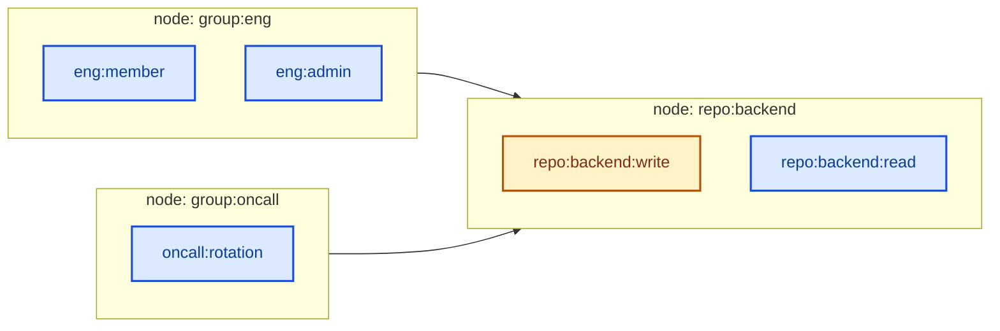

# Grant Expansion (Topological Projection)

We compute the transitive closure of grants over the entitlement DAG. The graph
(nodes + edges) is small and stays in memory; the **grants** ("who has which
entitlement") are huge and are streamed. Walking the DAG in topological order,
we reduce **one destination entitlement at a time** once all its parents are
finalized.

## The graph

Edges connect **nodes**, not individual entitlements. A node can hold **several
entitlement IDs** — entitlements that formed a cycle are collapsed together into
one node. For an edge `parent -> child`, *every* source entitlement in the
parent node is a contribution stream for *every* destination entitlement in the
child node.



## Reducing one destination

We reduce a single destination entitlement: `D = repo:backend:write` (inside
node `repo:backend`). Its source streams are every entitlement in the parent
nodes — `eng:member`, `eng:admin`, `oncall:rotation`. Here `eng:admin` has no
grants, so its empty stream is omitted from the trace. The merge advances in
principal order; every contributor to a principal is gathered before that
principal is decided.

```mermaid
sequenceDiagram
    autonumber
    participant Drv as Driver (topological)
    participant Base as base(D)
    participant E1 as src eng:member
    participant E2 as src oncall:rotation
    participant M as Merge (per principal)
    participant DB as Grant store

    Note over Drv,DB: Reduce D = repo:backend:write (parent nodes already finalized)
    Drv->>M: start merge for D
    Base->>M: sorted stream [Alice, Dave]
    E1->>M: sorted stream [Alice (direct), Bob (direct)]
    E2->>M: sorted stream [Bob (indirect), Carol (direct)]

    rect rgb(220,252,231)
    Note over M,DB: principal = Alice
    M->>M: C = {eng:member:direct}; base exists with no Sources
    M->>DB: UPDATE Alice: add self {D}, then eng:member -> Sources {D, eng:member}
    end

    rect rgb(219,234,254)
    Note over M,DB: principal = Bob
    M->>M: C = {eng:member:direct, oncall:rotation:indirect}; no base grant
    M->>DB: SYNTHESIZE Bob: new grant, Sources {eng:member, oncall:rotation}
    end

    rect rgb(219,234,254)
    Note over M,DB: principal = Carol
    M->>M: C = {oncall:rotation:direct}; no base grant
    M->>DB: SYNTHESIZE Carol: new grant, Sources {oncall:rotation}
    end

    rect rgb(229,231,235)
    Note over M,DB: principal = Dave
    M->>M: C = {} (no contribution); base exists
    Note right of M: SKIP - no write, existing grant untouched
    end

    M-->>Drv: D finalized
```

Outcomes per principal:

| principal | base on D | combined sources C | result |
|-----------|-----------|--------------------|--------|
| Alice | exists, no Sources | `{eng:member:direct}` | UPDATE -> `{D, eng:member}` |
| Bob | none | `{eng:member:direct, oncall:rotation:indirect}` | SYNTHESIZE new grant |
| Carol | none | `{oncall:rotation:direct}` | SYNTHESIZE new grant |
| Dave | exists | `{}` | SKIP (untouched) |

Key properties: each stream is scanned once in sorted order, the grant set never
fully loads into memory (only the active per-principal frontier does), and
`direct` beats `indirect` when sources combine.

The **projection** optimization only changes *where* the source streams come
from: source grants are pre-sorted once into a temporary scratch Pebble DB, so
parents are read with range scans instead of random point lookups, and each
finalized entitlement's output is appended back so its children can read it.
